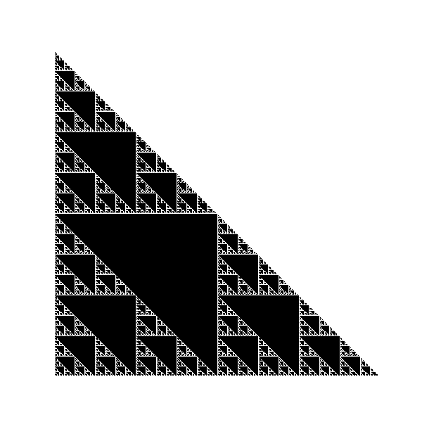

triforce
=====================


**Contents**
- [triforce](#triforce)
  - [Installation](#installation)
  - [Contributing](#contributing)
  - [Team](#team)
  - [Citing](#citing)

Triforce is suite of tools for the numerical exploration of triangular arrays. It allows you to manipulate well-known
triangular arrays (i.e. Pascal's triangle, the Hosoya triangle, Bell's triangle, etc.) and also to define your own
triangle via specifying generating functions.

For example, the following code allows you to define Pascal's Triangle for a given number of rows. You can use the
functionality of triforce to investigate various numerical properties of the triangle.

```python3
>>> from triforce.triangles import PascalTriangle
>>> triangle = PascalTriangle(10)
>>> 
>>> # Print the output as a triangular shape:
>>> print(triangle)
                           1 
                         1     1 
                      1     2     1 
                   1     3     3     1 
                1     4     6     4     1 
             1     5    10    10     5     1 
          1     6    15    20    15     6     1 
       1     7    21    35    35    21     7     1 
    1     8    28    56    70    56    28     8     1 
 1     9    36    84    126   126   84    36     9     1 

>>> # Extract the right-most diagonal of the triangle:
>>> print(triangle.diagonal(diagonal_index=0, direction="right"))
[1, 1, 1, 1, 1, 1, 1, 1, 1, 1]

>>> # Extract the second-to-the-right-most diagonal of the triangle:
>>> print(triangle.diagonal(diagonal_index=1, direction="right"))
[1, 2, 3, 4, 5, 6, 7, 8, 9]

>>> # Extract the center entries of the triangle:
>>> print(triangle.center())
[1, 2, 6, 20, 70]

>>> # Extract row sums:
>>> print(triangle.row_sums())
[1, 2, 4, 8, 16, 32, 64, 128, 256, 512]

```

You can also define your own triangular array by creating a class that inherits from the `Triangle` class

```python3
from triforce.triangle import Triangle

class WythoffTriangle(Triangle):
    def generate_triangle(self) -> list[list[int]]:
        """Generate the Wythoff triangle up to row n using Fibonacci recurrence."""
        triangle = []

        for i in range(self.n):
            row = []
            
            # First element: lower Wythoff sequence
            if i == 0:
                row.append(0)  # Starting element for Wythoff triangle
            else:
                row.append(lower_wythoff(i))

            # Middle elements: Fill using Fibonacci recurrence
            for j in range(1, i):
                # Fibonacci recurrence: current element is the sum of the two elements above it
                row.append(triangle[i-1][j-1] + triangle[i-1][j])

            # Last element: upper Wythoff sequence
            if i > 0:
                row.append(upper_wythoff(i))

            triangle.append(row)

        return triangle
```

One can also visualize properties of the triangles by plotting. Here is an example of visualizing Pascal's triangle such
that the even and odd terms are replaced by black and white pixels, respectively.

```python3
from triforce.plots import highlight_plot
from triforce.numerics import is_even

highlight_plot(PascalTriangle(n=510), is_even)
```




## Installation
Triforce is available on PyPI, and can be installed with
```
pip install triforce
```

## Contributing
We appreciate all contributions. You don't need to be an expert in triangular arrays or number theory to help out.

Contributions should be submitted as [pull requests](https://github.com/vprusso/triforce/pulls).  A member of the
triforce development team will review the pull request and guide you through the contributing process.

## Team
Triforce is a community project, built from the contributions of many researchers and engineers. Triforce is developed
and maintained by [Vincent Russo](https://vprusso.github.io/)

## Citing

You can cite `triforce` using the following DOI: X


If you are using the `triforce` software package in research work, please include an explicit mention of `triforce` in
your publication. Something along the lines of:

```
To solve problem "X" we used `triforce`; a package for studying numerical properties of triangular arrays.
```

A BibTeX entry that you can use to cite `triforce` is provided here:

```bib
@misc{triforce,
   author       = {Vincent Russo},
   title        = {triforce: A {P}ython toolkit for numerical analysis of triangular arrays},
   howpublished = {\url{https://github.com/vprusso/triforce}},
   month        = Dec,
   year         = 2024,
   doi          = {X}
 }
```
